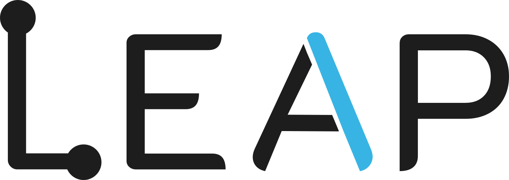

<div align="center">

<a href="https://leap.sa">
  <picture>
    <source media="(prefers-color-scheme: dark)" srcset="assets/brand/leap-logo-dark.svg">
    
  </picture>
</a>

# Mulaim · مُلائم

**Will that local LLM fit comfortably on your machine?**
**هل سيعمل النموذج المحلي بارتياح على جهازك؟**

[](Cargo.toml)
[](LICENSE)
[](#بالعربية)
[](Dockerfile)
[](https://leap.sa)

One tiny Rust binary, three tools: a **CLI**, a **bilingual web app** (English / العربية, full RTL), and a **JSON API**.

</div>

---

Mulaim estimates whether a GGUF quantization (Q3_K_M → Q8_0) of a model runs comfortably in your unified memory while leaving room for Docker and your other workloads — then tells you the **best fit** directly.

> **Note** — Estimates are heuristics, not measurements. Always test on your machine.

## Features

- **Best-fit verdict** — one clear answer per check (e.g. *Q6_K — Easy*), aligned with community quantization advice.
- **Machine auto-detection** — real memory and chip via `sysctl` / `/proc/meminfo` when run locally; privacy-safe by design (see [Machine auto-detection](#machine-auto-detection)).
- **Smart model resolution** — raw sizes, local **Ollama** models (true parameter counts), **Hugging Face** metadata (`safetensors` totals), then name parsing.
- **Bilingual, RTL-first UI** — Arabic and English with one-tap switching, styled after the [leap.sa](https://leap.sa) design language (Cairo, `#1d1d1d`, `#37b3e3`).
- **Visual memory picture** — stacked memory-fit bars, quantization tables, and a side-workload matrix (programming, video editing, gaming).
- **Non-tech friendly** — tap-to-pick memory chips with auto-set reserves; advanced fields tucked away.
- **Ops friendly** — single static binary, stateless, `PORT`-aware, `/health` endpoint, Docker multi-stage build.

## Quick start

```bash
# Web app → http://localhost:8080
cargo run --release -- serve

# CLI
cargo run --release -- 12b
cargo run --release -- qwen3:14b
cargo run --release -- 27b --total 64 --os 10 --docker 8
cargo run --release -- 12b --json        # machine-readable report
```

The web UI auto-detects your browser language (Arabic-first), prefills your machine's memory when running locally, and makes results shareable via URL (`/?model=qwen3:14b&total=64&lang=ar`).

## JSON API

```bash
curl 'http://localhost:8080/api/check?model=qwen3:14b&total=64&os=10&docker=8'
```

```jsonc
{
  "generator": "Mulaim ملائم — LEAP RD&O واثب · https://leap.sa",
  "resolved_name": "Qwen/Qwen3-14B",
  "params_b": 14.8,
  "best": { "label": "Q6_K", "fit": "easy", "runtime_total_gb": 17.8 },
  "quants": [ { "label": "Q4_K_M", "weights_gb": 8.9, "runtime_total_gb": 13.3, "base_fit": "easy" } /* … */ ],
  "workloads": [ /* per-workload fits */ ]
}
```

Endpoints: `GET /api/check` (full report), `GET /api/machine` (local hardware, loopback-only), `GET /health` (liveness; `/healthz` also works).

### Machine auto-detection

- **CLI** — total memory and chip name are detected automatically; `--total` overrides.
- **Web** — `GET /api/machine` answers **only loopback clients with no forwarding headers**: running `mulaim serve` on your own machine prefills your real memory, while a hosted deployment never presents the server's hardware as the visitor's. Browsers cannot inspect a visitor's RAM, so hosted users pick their memory from preset chips.

## How the estimate works

| Quant | ~bytes/param | | Rule | Meaning |
|---|---|---|---|---|
| Q3_K_M | 0.49 | | `weights` | `params × bytes/param` |
| Q4_K_M | 0.60 | | min total | ≈ 1.1 × weights |
| Q5_K_M | 0.70 | | safe runtime | ≈ 1.5 × weights (KV cache + overhead) |
| Q6_K | 0.80 | | **Easy** | runtime ≤ 75% of available budget |
| Q8_0 | 1.06 | | **Possible / Tight** | ≤ 100% / beyond |

Side workloads (programming, video editing, gaming) subtract an extra reserve before fitting.

## Deployment

Stateless and self-contained: one container, one port, no database, no volumes. Binds `0.0.0.0`, honors `PORT`.

```bash
docker build -t mulaim .
docker run --rm -p 8080:8080 mulaim          # web app
docker run --rm mulaim 12b                   # CLI
docker compose up --build
```

### Hosting handoff — [LEAP RD&O واثب](https://leap.sa)

| Item | Value |
|---|---|
| Build | `docker build -t mulaim .` (multi-stage, no build args) |
| Run | `docker run -p 80:8080 mulaim` — or set `PORT` |
| Health check | `GET /health` → `200 ok` |
| Resources | ~256 MB RAM, minimal CPU; scales horizontally (stateless) |
| Outbound | HTTPS to `huggingface.co` only (optional; degrades gracefully) |
| TLS / domain | terminate at the proxy; no app config needed |

Also ready for **Fly.io** ([fly.toml](fly.toml)), **Render** ([render.yaml](render.yaml)), and **Railway** (Dockerfile auto-detected).

## Project layout

| Path | Purpose |
|---|---|
| [src/calc.rs](src/calc.rs) | Estimation engine — quants, fits, best-fit verdict, workloads |
| [src/resolve.rs](src/resolve.rs) | Model resolution — Ollama, Hugging Face, name parsing |
| [src/machine.rs](src/machine.rs) | Hardware detection (macOS / Linux) |
| [src/server.rs](src/server.rs) | Axum web server + JSON API |
| [assets/index.html](assets/index.html) | Bilingual UI, embedded into the binary at build time |
| [legacy/](legacy/) | Original single-file version, kept for reference |

## Development

```bash
cargo build          # debug build
cargo test           # unit tests (estimation, resolution, best-fit)
cargo run -- serve --host 127.0.0.1 --port 8080
```

Keep the client-side fallback constants in `assets/index.html` in sync with `src/calc.rs` when touching the estimation math. CI builds and tests every push ([.github/workflows/ci.yml](.github/workflows/ci.yml)).

## License

[MIT](LICENSE) © [LEAP RD&O واثب](https://leap.sa)

---

<div dir="rtl">

## بالعربية

**مُلائم** أداة تقدّر ما إذا كان نموذج لغوي محلي (بتكميم GGUF من Q3_K_M إلى Q8_0) سيعمل بارتياح في ذاكرة جهازك الموحّدة، مع ترك مساحة لـ Docker وأعمالك الأخرى — ثم تعرض لك **الخيار الأنسب** مباشرة.

برنامج Rust واحد صغير يجمع ثلاثة أدوات:

- سطر أوامر: <code dir="ltr">mulaim 12b</code>
- تطبيق ويب ثنائي اللغة (عربي/إنجليزي بدعم كامل للكتابة من اليمين لليسار): <code dir="ltr">mulaim serve</code> ثم افتح <code dir="ltr">http://localhost:8080</code>
- واجهة JSON برمجية: <code dir="ltr">GET /api/check?model=12b&total=64</code>

**أبرز الميزات:** اكتشاف تلقائي لذاكرة الجهاز والمعالج عند التشغيل المحلي، والتعرّف على النماذج عبر Ollama المحلي ثم Hugging Face، واختيار الذاكرة بلمسة واحدة لغير التقنيين، وأشرطة ذاكرة وجداول ملاءمة، وتصميم متوافق مع الهوية البصرية لموقع <a href="https://leap.sa">واثب leap.sa</a>.

للنشر: أي استضافة تدعم Docker تكفي — حاوية واحدة بلا قواعد بيانات، وفحص الجاهزية عبر <code dir="ltr">GET /health</code>.

التقديرات إرشادية وليست قياسات دقيقة — جرّب دائمًا على جهازك.

**الترخيص:** MIT © <a href="https://leap.sa">واثب LEAP RD&O</a>

</div>

---

<div align="center">

<a href="https://leap.sa">
  <picture>
    <source media="(prefers-color-scheme: dark)" srcset="assets/brand/leap-logo-dark.svg">
    
  </picture>
</a>

**Hosted & operated by LEAP RD&O واثب · استضافة وتشغيل واثب**
[leap.sa](https://leap.sa)

</div>
